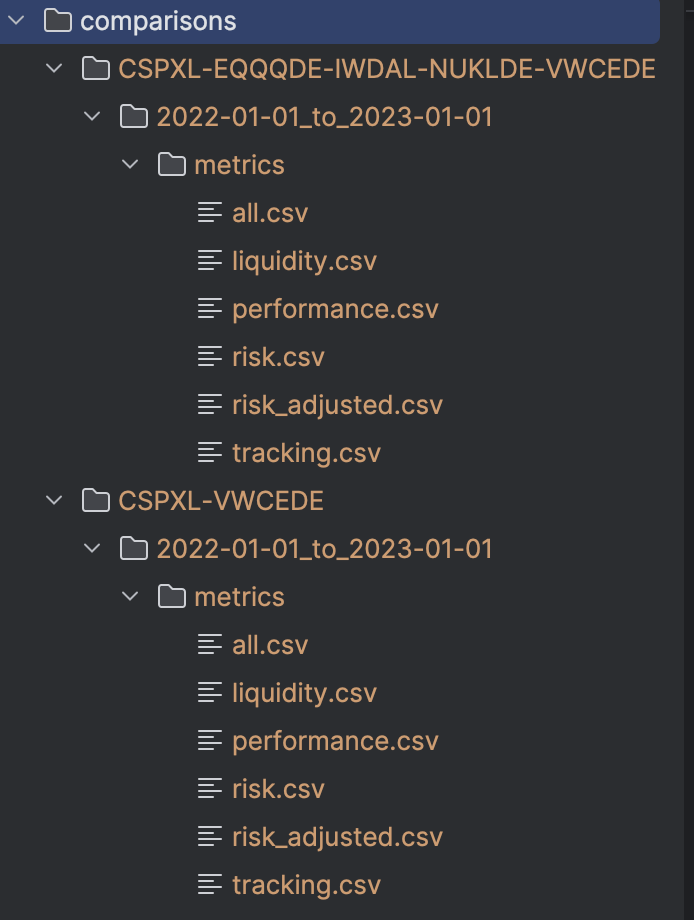

# Devlog 

This is my personal development journal for this ETF Screener project.  
This is the second time I try to write since I forgot to commit and push, so if these first days are a little less detailed and a little bit rushed is because of this error :).

## 22/08/25
This is the day I decided to restart my journey on github, I had my first experiences a few years ago but before and after that I just developed on my own, on my pc.
So a few days prior to this, I thought about creating something that could be useful to my investing, a tool designed on my investment strategy in ETF.

The first day, the only function available was `fetch`, a command that downloads ETF prices and volumes from Yahoo Finance. I also implemented the possibility to write the ticker without the suffix. If you do so, the program tries every suffix (from the most common ones to the least) and uses the first one that works.

## 23/08/25 - based on my memory
On this day I reworked how data gets saved. Now each ticker has a folder with folders for each time period selected

## 24/08/25 - based on my memory
On the 24th I added the second function: `metrics`. 
Now it's possible to compute these metrics:

| Category              | Metric             | Description |
|-----------------------|-------------------|-------------|
| **Performance**       | `total_return`    | Total return over the selected period |
|                       | `cagr`            | Compound Annual Growth Rate (annualized return) |
|                       | `best_month`      | Best monthly return |
|                       | `worst_month`     | Worst monthly return |
| **Risk**              | `vol_ann`         | Annualized volatility |
|                       | `max_dd`          | Maximum drawdown |
|                       | `dd_duration_days`| Maximum drawdown duration (in days) |
|                       | `recovery_days`   | Days needed for recovery (if any) |
|                       | `downside_vol`    | Downside volatility |
| **Risk-adjusted**     | `sharpe`          | Sharpe ratio (risk-adjusted return) |
|                       | `sortino`         | Sortino ratio (downside risk-adjusted return) |
| **Distribution**      | `skew`            | Skewness of returns (asymmetry) |
|                       | `kurtosis`        | Kurtosis of returns (fat tails) |
| **Liquidity**         | `avg_daily_volume`| Average daily trading volume |


And the folder structure used was updated, at this moment there were folders for each ticker, a folder for each comparison and a folder called all_ticker were all the tickers for a specific time period were saved.

This is a preview of how the comparison folder looked:


And this is an example of what you could find in a .csv in the all_tickers folder:
| Ticker  | Total Return |   CAGR   | Vol. Ann |  Max DD  | Sharpe  | Sortino | Avg. Daily Vol. | Best Month | Worst Month | DD Duration (days) | Recovery Days | Downside Vol |   Skew   | Kurtosis |
|---------|--------------|----------|----------|----------|---------|---------|-----------------|------------|-------------|--------------------|---------------|--------------|----------|----------|
| **VWCE.DE** | -0.1354      | -0.1369  | 0.1716   | -0.1612  | -0.8348 | -1.1995 | 77,050.18       | 0.0911     | -0.0607     | 255                | 0.0           | 0.1194       | -0.3590  | 0.7417   |
| **CSPX.L**  | -0.1903      | -0.1928  | 0.2267   | -0.2423  | -0.8196 | -1.2675 | 114,103.83      | 0.0841     | -0.0812     | 249                | —             | 0.1466       | -0.1750  | 0.2890   |
| **IWDA.L**  | -0.1849      | -0.1873  | 0.2236   | -0.2584  | -0.8008 | -1.2721 | 441,801.92      | 0.0742     | -0.0866     | 249                | —             | 0.1408       | -0.0742  | 0.3188   |
| **EQQQ.DE** | -0.2981      | -0.3010  | 0.2536   | -0.3019  | -1.3741 | -2.0895 | 14,241.84       | 0.1402     | -0.0926     | 256                | —             | 0.1668       | -0.2463  | 0.1850   |

## 25/08/25
This is the day I did WAY more work than the others, and also the day I lost the DEVLOG file.
I started the day with the idea of writing a better `--help` but i ended up doing a lot more work.

Now `fetch` and `metrics`include detailed `--help` sections with examples showing typical usage. Each examples also uses different colors to make the help output easier to read and therefor more useful.

### Global Help
```console
(.venv) me@My-MacBook-Air etf-screener % python cli.py -h

Usage: cli.py [OPTIONS] COMMAND [ARGS]...

 A small CLI to download ETF data, compute metrics, and save tidy outputs.

Options:
  --verbose  -v   More logs.
  --quiet    -q   Less logs.
  --version       Show version and exit.
  --help     -h   Show this message and exit.

Commands:
  fetch     Download ETF price/volume data and save per-ticker/per-period bundles.
  metrics   Compute performance/risk metrics and save them per ticker (and comparisons).
```

### Fetch Help

```console
(.venv) me@My-MacBook-Air etf-screener % python cli.py fetch -h

Usage: cli.py fetch [OPTIONS]

Download ETF price/volume data and save per-ticker/per-period bundles.

Options:
  --tickers  TICKER      Repeat for multiple symbols (e.g. VWCE, CSPX, IWDA).
                        You can omit exchange suffixes; the CLI will try to resolve them.
                        [required]
  --start    YYYY-MM-DD  Start date (YYYY-MM-DD). [required]
  --end      YYYY-MM-DD  End date (YYYY-MM-DD). [required]
  --quiet    -q          Less logs.
  --verbose  -v          More logs.
  --help     -h          Show this message and exit.

Examples:
  Single ticker (auto-suffix)          python cli.py fetch --tickers VWCE --start 2022-01-01 --end 2023-01-01
  Multiple tickers (with/without suffix) python cli.py fetch --tickers VWCE --tickers CSPX.L --start 2022-01-01 --end 2023-01-01
  Longer period (5 years)              python cli.py fetch --tickers IWDA.L --start 2018-01-01 --end 2023-01-01
  Quiet mode                           python cli.py fetch --tickers VWCE --start 2022-01-01 --end 2023-01-01 -q
  Verbose mode                         python cli.py fetch --tickers VWCE --start 2022-01-01 --end 2023-01-01 -v
```
### Metrics Help
```console
(.venv) me@My-MacBook-Air etf-screener % python cli.py metrics -h

Usage: cli.py metrics [OPTIONS]

Compute performance/risk metrics and save them per ticker (and comparisons).

Options:
  --tickers   TICKER      Repeat for multiple symbols (e.g. VWCE, CSPX, IWDA).
                         You may omit suffixes. [required]
  --start     YYYY-MM-DD  Start date (YYYY-MM-DD). [required]
  --end       YYYY-MM-DD  End date (YYYY-MM-DD). [required]
  --benchmark TICKER      Optional benchmark (e.g. ^GSPC). Adds BM_all.csv alongside all.csv.
  --detailed              Also save split packs (performance, risk, risk_adjusted, tracking, liquidity).
  --show                  Print a compact overview in console.
  --quiet     -q          Less logs.
  --verbose   -v          More logs.
  --help      -h          Show this message and exit.

Examples:
  Two tickers + show summary              python cli.py metrics --tickers VWCE --tickers CSPX.L --start 2022-01-01 --end 2023-01-01 --show
  With benchmark                          python cli.py metrics --tickers VWCE --start 2022-01-01 --end 2023-01-01 --benchmark ^GSPC
  Detailed packs                          python cli.py metrics --tickers VWCE --tickers CSPX.L --start 2022-01-01 --end 2023-01-01 --detailed
  Two tickers + benchmark + detailed      python cli.py metrics --tickers VWCE --tickers IWDA.L --start 2021-01-01 --end 2023-01-01 --benchmark ^GSPC --detailed --show
  Quiet mode                              python cli.py metrics --tickers VWCE --start 2022-01-01 --end 2023-01-01 -q
  Verbose mode                            python cli.py metrics --tickers VWCE --start 2022-01-01 --end 2023-01-01 -v
```

### Additional work done

#### Benchmark
Technically the `--benchmark` flag already existed but was incomplete.
I found out that it was not working well (the metrics were computed but not saved), so I fixed this problem and updated how metrics are saved.
Before, every time the metrics function was used, a csv. with all the metrics was created together with a csv. for each category of metrics (Performance, Liquidity, etc.).
Now, as you can see above, in Metrics Help, there is a `--benchmark` and a `--detailed` option.
When none of this are selected, only the all.csv file is created, when only detailed is selected then also a csv file for each category is created, if only the benchmark option is selected then all.csv and BM_all.csv are created.
If both are selected then all.csv, BM_all.csv and all the "category .csv" are created.

#### Quiet and Verbose
Added `--quiet`/`-q` and `--verbose`/`-v`, see --help, at both global and command level, so minimal or detailed logging can be viewed based on preferences

#### Fixed error management
Now some edge cases like: invalid dates, start date after end date, etc., give clear error messages.

#### Reorganized internal code
This was the most long and laborious part, once finished coding the things above I decided I wanted to make the `fetch` and `metrics` functions more generalized, without duplicated code.
I made this decision because I remember what my highschool professor taught me.
It started simple but I ended up creating a new file src/cli_utils.py where most of the cli.py code ended up.
Now cli.py looks much more cleaner, maybe too much clean. I think I should check the projects I was doing in High School because I think I moved too much code in separated functions. I hope I will not regret it in future.

## 26/08/25
This day was dedicated to rewriting all the DEVLOG. 
So if you see this, it means I finally remembered to push

## 28/08/25
Today was a pretty busy day so I just fixed a bug I found two days ago, now typing the same suffix more times, in the same command, will not give an error.
